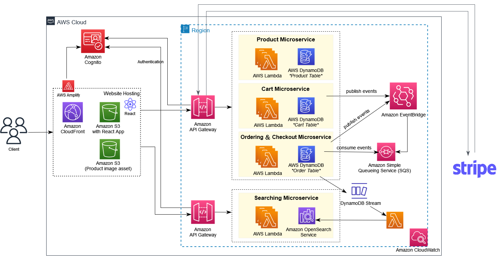

# Serverless Simple Shop using Golang and ReactJS on AWS

Serverless Simple Shop is a cloud-native demo application, with basic E-commerce features such as a shopping cart, product searching, product gallery, favorites feature, and stripe online payment.

It is a full-stack application implements event-driven microservices architecture with using AWS serverless services *for demonstration purpose only*. Its backend is written in Golang with a frontend UI written in ReactJS. Such an architecture reduces operational costs, and management overheads, and enables high scalability and availability without additional effort from the developer.

Demo: [https://d3sjpgg015wjwv.cloudfront.net](https://d3sjpgg015wjwv.cloudfront.net)

## Architecture Diagram 

AWS provides everything we need to build scalable serverless app. We also use Stripe to process payments for our website. Below diagram illustrates the solution architecture of Simple Shop demo app:

## Stack Overview

### Backend

The backend is build and deploy to AWS using the AWS Serverless Application Model (AWS SAM). See more information about our sam [template.yaml](./backend/template.yaml).

* **Computing** - AWS Lambda is a serverless, event-driven computing service that enable us to create a highly distributed and scalable system.

* **Authentication** - Amazon Cognito User Pool provides customer identity and access management (CIAM) service. In this demo app, users can register/authenticate to the simple shop web app through Cognito User Pool to obtain permission to access specific resources, such as "Add to cart" and "Add to favorite" features.

* **API** - Amazon API Gateway acts as a bridge between external apps and our microservices(AWS Lambda functions). And we also secure REST API endpoints by utilizing Cognito User Pool with Amazon API Gateway.

* **Data persistence** - Data are mainly store in DynamoDB tables which are required for the application. These tables are accessed from the Lambda functions. In order to calculate top selling products, we use DynamoDB Stream to capture changes to items in the Order Table and forward the streaming data to update OpenSearch service cluster, use AWS Lambda function as event handlers.

* **Searching** - Amazon OpenSearch offers the search capabilities for products and best-sellers ranking. Demo app's in-app search feature powered by OpenSearch's fuzzy query allows users to search product by partial words or with typoed.

* **Messaging** - We use Amazon EventBridge and Amazon Simple Queue Service(SQS) to decouple serverless workloads and handle asynchronous communication between microservices. When the checkout service or stripe webhook receives a new order or payment status update event from Stripe, it will publish event to the EventBridge, and then consume by worker services in Checkout Microservice via the Amazon SQS.

### Frontend

* **UI** - Building the single page application using a combination of ReactJS UI library, AWS Amplify UI component for authentication and Stripe Payment Element for securely collecting payment details.

* **Distribution** - Delivering static websites content hosted on Amazon S3 with Amazon CloudFront. And set up Cloudfront Origin Access Control (OAC) to restrict public access to S3 buckets.

## RESTful API

Service APIs created with Amazon API Gateway and restrict access using Cognito User Pool. Some specific management-related API endpoints require the permissions of the admin group in Cognito to access. All backend services are written in Golang and deployed to AWS Lambda function.

### Product Service

GET /product?category=:category (GetProductByCategory) \
GET /product?topic=:topic (GetProductByTopic) \
GET /product?productId=:productId (GetProductById) \
GET /product/batch-fetch (BatchGetProductsByIds) \
POST /product (CreateProduct) \
POST /product/batch-write-item (BatchWriteProducts) \
PUT /product/{productId} (UpdateProduct) \
DELETE /product/{productId} (DeleteProduct) \
GET /product/favorites (GetUserAllFavorites) \
POST /product/favorites (AddToFavorite)  

### Cart Service

GET /cart (GetUserCartItems) \
GET /cart/{productId} (GetCartItemByProductId) \
POST /cart (AddToCartFunction) \
PUT /cart (UpdateCartItem) \
DELETE /cart (DeleteItemFromCart) 

### Checkout Service

POST /checkout/create-payment-intent (CreatePaymentIntent) \
POST /payment/webhook (StripeWebhook) 

### Order Service

GET /order/past-orders (GetPastOrders)

### Search Service

GET /search/fuzzy-query (FuzzyQueryFunction) \
GET /search/purchased-ranking (PurchasedRankingFunction) \
POST /search/bulk-write (BullWriteProductIndexesFunction) 

## DynamoDB Tables

### Product Table

| Partition key | Sort key | Attributes |
|---|---|---|
| productId || name, description, imageFile, company, rating, topic, category, price |

#### Global Secondary Indexes
##### topic-index
| Partition key | Sort key |
|---|---|
| category | productId |

##### category-index

| Partition key | Sort key |
|---|---|
| topic | productId |

### Favorite Table

| Partition key | Sort key | Attributes |
|---|---|---|
| userId | productId |  |

### Cart Table

The <code>expirationTime</code> attribute is set as the TTL attribute on the table.

| Partition key | Sort key | Attributes |
|---|---|---|
| userId | productId | quantity, price, expirationTime |

### Order Table

| Partition key | Sort key | Attributes |
|---|---|---|
| userId | paymentIntentId | orderId, total, shippingFee, address, email, items, orderDate, paymentStatus, subtotal |

## EventBridge and SQS Integration

Serverless is all about functions and events by nature. Amazon EventBridge can react to AWS service events, external SaaS provider events and custom defined events. We set up a custom event bus with event rules to filter incoming events from checkout service and stripe webhook. When matching events are sent to EventBridge that trigger the rule, they will then be delivered to target SQS queues. Finally, the events will be processed and deleted by consumer or send to DLQ (Dead letter queue) for events that can't be processed successfully. 

| Event rule | Target | Consumer |
|--|--|--|
| CheckoutEventRule | SQS (CheckoutOrderSQS) | Lambda (CheckoutOrderWorker) |
| UpdateOrderStatusEventRule | SQS (UpdateOrderStatusSQS) | Lambda (UpdateOrderStatusWorker) |
| DeleteCartEventRule | SQS (DeleteCartSQS) | Lambda (DeleteCartWorker) |

## DynamoDB Stream and OpenSearch Integration

In order to get top selling products for our simple shop website by querying api, we enable stream on the Order Table, any new item event in the Order Table will be captured by DynamoDB Stream and send as **New image** (the entire item) to the invoked Lambda function. The invoked function parses the new order data and updates <code>counter</code> field value of documents by product in the <code>product-sold-counter</code> index to the OpenSearch domain cluster. So, we can execute sorting on <code>counter</code> field to list top selling product by querying PurchasedRanking api.

## Reference
* [AWS Serverless Application Model](https://aws.amazon.com/serverless/sam/)
* [AWS Event-driven Serverless Microservices using AWS Lambda, API Gateway, EventBridge, SQS, DynamoDB and CDK for IaC](https://medium.com/aws-serverless-microservices-with-patterns-best/aws-event-driven-serverless-microservices-using-aws-lambda-api-gateway-eventbridge-sqs-dynamodb-a7f46220b738)
* [Building an event-driven application with Amazon EventBridge](https://aws.amazon.com/blogs/compute/building-an-event-driven-application-with-amazon-eventbridge/)
* [AWS Bookstore Demo App](https://github.com/aws-samples/aws-bookstore-demo-app)
* [Stripe | Find a guide to integrate Stripe's payments APIs.](https://stripe.com/docs/payments)
